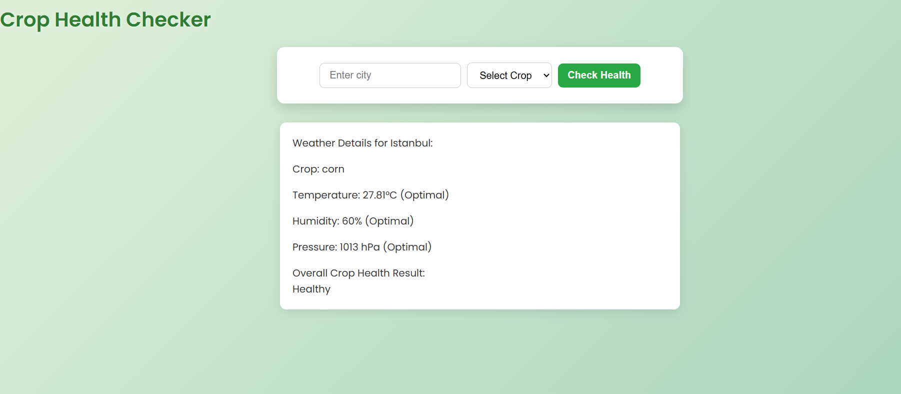
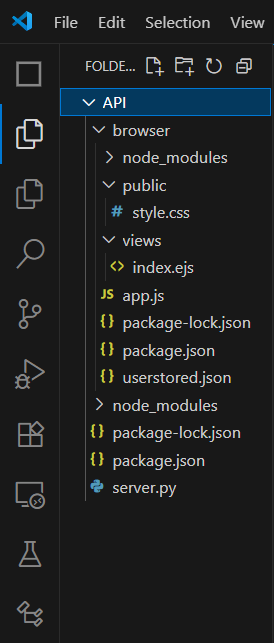
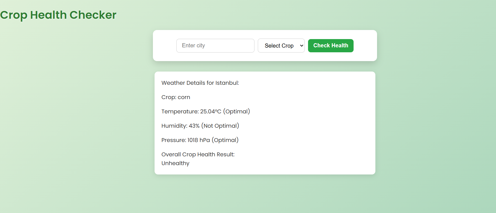
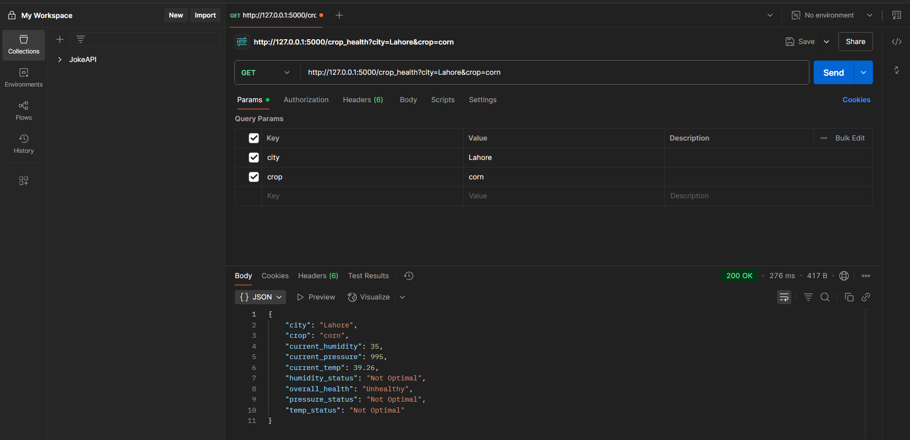
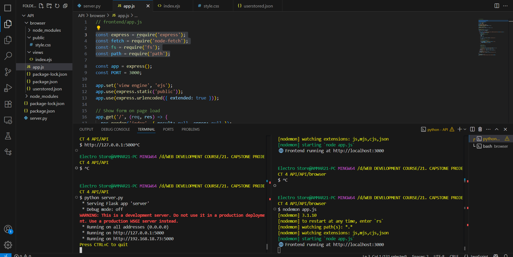

## 🌾 Crop Health Checker

**Crop Health Checker** is a smart weather-based web application that helps farmers and agricultural enthusiasts determine whether a crop is growing under optimal environmental conditions. 
Fetches real-time weather data based on user-input city names and compares it to ideal temperature, humidity, and pressure values for four major crops: **wheat, corn, rice, and cotton**.

---

## 🛠️ Tech Stack

- **Python(Flask)** | backend API Server.). File name **server.py.**
- **JavaScript (Node.js + EJS)** | (Frontend rendering.). Files **app.js and index.ejs.**
- **CSS** | (UI styling). File name **style.css.**
- **OpenWeatherMap API** | (Real-time weather data.)
- **JSON File System** | (Local data storage.). File name **userstored.json.**
- Used **Visual Studio Code** software to implement the above files.

---

## 🚀 Live Features

Users can:
- **User inputs** the city and crop name on the frontend.
- **Frontend sends a GET request** to Flask backend.
- **Backend fetches live weather data** using OpenWeatherMap API.
- The data is **compared to crop-specific optimal conditions**.
- The app shows **health status** (temperature/humidity/pressure + overall).
- All input data is saved to a local **JSON file.**

---

## 🖼️ UI Preview
> 

---

## 📂 Folder Structure
> 

---

## 🛠️ Testing
> 
> 

---

## 🚀 How to Run the Project

To clone this project, run the following in your **Visual Studio terminal**:
- git clone https://github.com/Syed-Ammar-21/Crop_Health_Checker.git
- cd Crop_Health_Checker
- Now you have navigated to your project folder using **cd**, mine was named **API** in folder structure. Install required dependencies in **Visual Studio
  terminal** like **pip install flask flask-cors requests** for python **server.py.**
- Now split the terminal and in that terminal navigate to folder **browser** and after navigating install required dependencies like **npm init -y** and
  **npm install express node-fetch** for **app.js.** 
- Now after doing al the above mentioned steps, in first terminal which has **API** route run **python server.py.**
- In second terminal which has **browser** route run **nodemon app.js.**
- You will see something like this below, then click on **🌐 Frontend running at http://localhost:3000** by **Ctrl + click.** Also if want to check only backend
  server, run it on **postman** as the screenshot is already placed in the **testing section.** Make sure to run only **python server.py.** before testing.
> 
