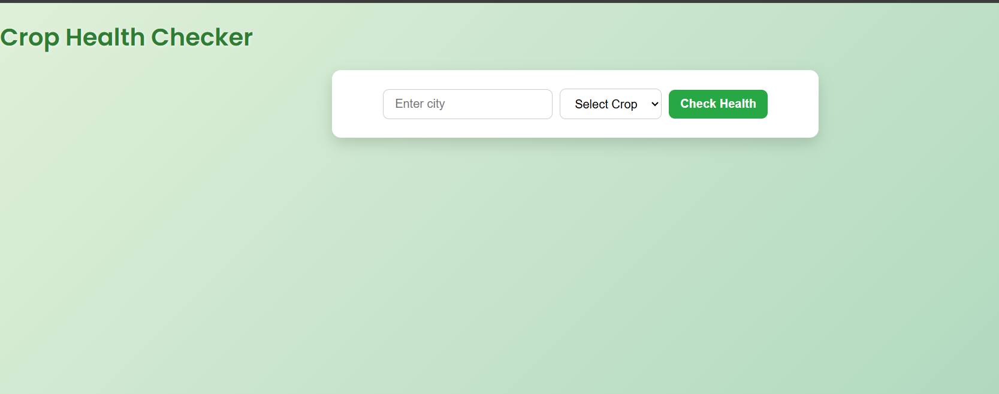

## 🌾 Crop Health Checker

**Crop Health Checker** is a smart weather-based web application that helps farmers and agricultural enthusiasts determine whether a crop is growing under optimal environmental conditions. 
Fetches real-time weather data based on user-input city names and compares it to ideal temperature, humidity, and pressure values for four major crops: **wheat, corn, rice, and cotton**.

---

## 🛠️ Tech Stack

- **Python(Flask)** | backend API Server.). File name **server.py.**
- **JavaScript (Node.js + EJS)** | (Frontend rendering.). Files **app.js and index.ejs.**
- **CSS** | (UI styling). File name **style.css.**
- **OpenWeatherMap API** | (Real-time weather data.)
- **JSON File System** | (Local data storage.). File name **userstored.json.**

---

## 🚀 Live Features

Users can:
- **User inputs** the city and crop name on the frontend.
- **Frontend sends a GET request** to Flask backend.
- **Backend fetches live weather data** using OpenWeatherMap API.
- The data is **compared to crop-specific optimal conditions**.
- The app shows **health status** (temperature/humidity/pressure + overall).
- All input data is saved to a local **JSON file.**

---

## 🖼️ UI Preview
> 

---

## 📂 Folder Structure
> 

---

## 🛠️ Testing
> 
> 

